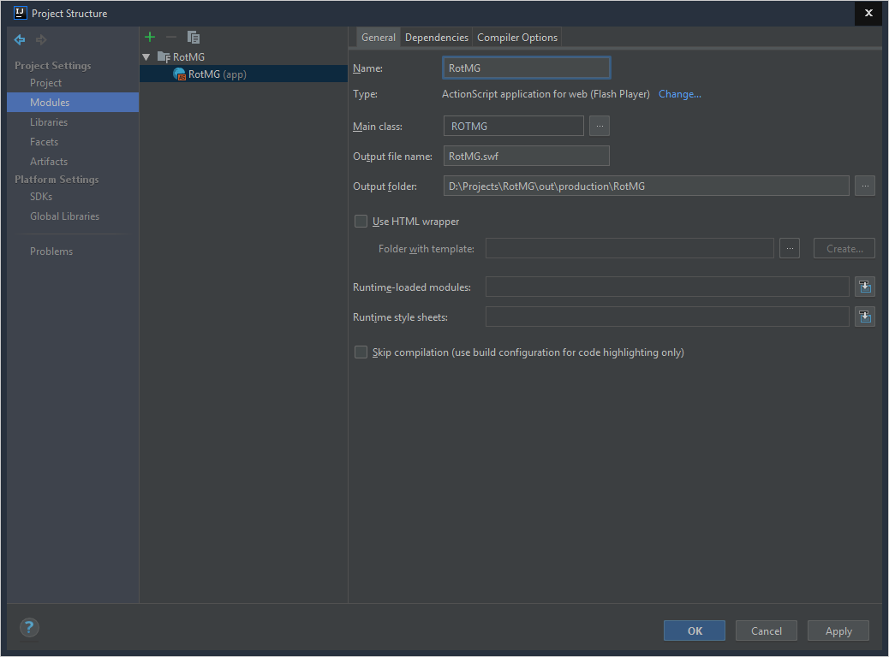

# RotMG
Realm of the Mad God - MMORPG Flash video game.
<br>
This repository contain source of the game client.
## Requirements
- IntelliJ IDEA or other IDE.
- Flex/Air SDK.
## Setup
1. Clone the repository to your computer.
```
git clone https://github.com/AkuNicza/RotMG.git
```
2. Start IDE and create new project.

3. On the left, choose base as Flash.
4. Check the "Pure ActionScript".
4. Choose your SDK.
5. Uncheck "Create sample app" and "Create HTML wrapper template".

6. Go to the next window, choose name and location of project.

7. Open tab File -> Project Structure. Or use default shortcut Ctrl + Alt + Shift + S.
8. Choose Flex/Air SDK and set language level to 10.

9. Open tab Libraries and add project lib's.

10. Open tab Modules, select project and current module.
11. Select ROTMG as main class.

12. Go to the compiler options and uncheck "Copy resource files to output folder", add this to additional compiler options:
```
-default-size 800 600 -default-frame-rate 60 -default-background-color #000000 -swf-version 30
```
